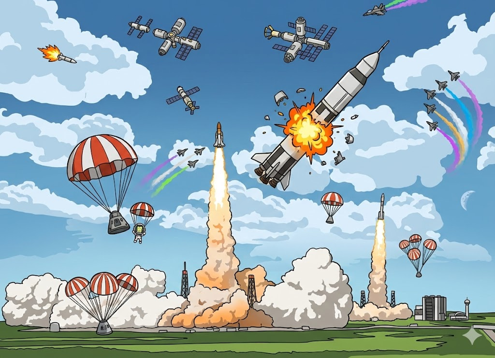

# Parsek



*Record, rewind, merge and loop your parallel-sekuential adventures in a single player main timeline.*

**Time-rewind mission recording for KSP1.** Record missions sequentially, return to an earlier time, and watch them play out in parallel alongside you while you fly new ones.

## How It Works

1. **Launch a mission** and fly it normally
2. **Recording starts automatically** when your vessel leaves the pad
3. **Merge your recorded mission** to the single player main timeline
4. **Rewind to any launch**
5. **Launch another mission** - your recorded flight replays alongside you - you can even loop it in the background!
6. **Vessel spawns** at its final recorded position with the original crew when playback finishes

Recorded vessels are full visual replicas - original part meshes, textures, engine flames, staging, and parachutes all play back at the correct times.

Time travel paradoxes are avoided by enforcing causality: events are always processed in time-axis order, and the timeline is strictly additive - recordings and game state changes can only be appended, never deleted or retroactively modified. This means the world state at any point in time is fully determined by the ordered sequence of committed events before it.

## Features

- **Automatic recording** on launch and EVA from pad
- **Visual replay** with original part meshes, textures, and engine FX
- **Looped playback** - fly missions and loop their recordings - add as many rockets, spaceships or aircraft in the sky as you want - great for in-game video recordings!
- **Vessel persistence** - recorded vessels spawn with crew, or get recovered for funds
- **Crew management** - reserved crew get temporary replacements so your roster stays full
- **Orbital recording** - time warp segments use analytical Keplerian orbits with attitude preservation (SAS-locked orientations like retrograde, normal, radial hold correctly throughout the orbit)
- **Part events** - staging, decoupling, parachutes, engines, solar panels, antennas, lights, landing gear, cargo bays, fairings, RCS, and inventory deployables replay on the ghost; docking / undocking are recorded as chain boundaries
- **Resource tracking** - game actions related to funds, science, and reputation deltas are recorded and applied at the correct time
- **Rewind to launch** - go back to any earlier point in your timeline; resources reset to baseline, ghost playback re-applies everything at the correct time
- **Rewind to separation** - go back to any past staging, undock, or EVA event and fly the sibling vessel you did not originally fly - take a spent booster back down for a self-landing recovery, fly the other half of an undock, or save a poor EVA kerbal that had to jump out; the previously-committed flight plays as a ghost while the new attempt commits additively alongside it
- **Multi-vessel recording** - undocking, EVA, and docking are tracked automatically; all vessels in a mission record as a single tree
- **Career mode integration** - milestones track tech research, part purchases, facility upgrades, and contracts; resource budgeting prevents paradoxes when rewinding
- **Recordings manager** - browse, sort, loop, and delete individual recordings
- **External recording files** - authoritative trajectory/snapshot sidecars keep saves lightweight, with default-on readable mirror files for storage debugging

## Controls

The Parsek window is available from the toolbar button in Flight and Map view.

## Supported Mods

| Mod | Integration |
|-----|-------------|
| [PersistentRotation](https://github.com/MarkusA380/PersistentRotation) | When detected, Parsek records vessel angular velocity at time warp boundaries. Ghost vessels spin during orbital playback, matching what the player saw with PersistentRotation active. Without it, ghosts hold their SAS-locked attitude (the correct behavior for stock KSP, which freezes rotation on rails). |
| [KSP Community Fixes](https://github.com/KSPModdingLibs/KSPCommunityFixes) | Fully compatible. KCF's `FlightIntegratorPerf` patch replaces the body of `VesselPrecalculate.CalculatePhysicsStats` for performance; Parsek's recording postfix on the same method composes cleanly on top, so recordings still capture every physics frame. Players running long missions with high part counts benefit from KCF's perf gains and its stock-bug fixes (packed-parts rotation, time-warp orbit drift, memory-leak cleanup). |

## Installation

Requires KSP 1.12.x.

**Dependencies** (install these first):

| Dependency | Author | License | Link |
|------------|--------|---------|------|
| Module Manager 4.2.3+ | sarbian | CC-BY-SA 3.0 | [GitHub](https://github.com/sarbian/ModuleManager) |
| HarmonyKSP 2.2.1+ | KSPModdingLibs (pardeike) | MIT | [GitHub](https://github.com/KSPModdingLibs/HarmonyKSP) |
| ClickThroughBlocker 2.1.10+ | linuxgurugamer | LGPL-3.0 | [GitHub](https://github.com/linuxgurugamer/ClickThroughBlocker) |
| ToolbarControl 0.1.9+ | linuxgurugamer | LGPL-3.0 | [GitHub](https://github.com/linuxgurugamer/ToolbarControl) |

Copy the `Parsek` folder into `GameData/`.

## Building from Source

```
cd Source/Parsek
dotnet build
```

Requires .NET SDK and KSP assemblies in `Kerbal Space Program/KSP_x64_Data/Managed/`.

## Beyond Recording

Parsek's infrastructure - looped playback, vessel snapshots, game state tracking, resource budgeting - forms a natural foundation to build on. These are not planned features, just ideas that the architecture makes possible:

- **Logistics network** - fly a cargo route once, Parsek records it, then that recording becomes a reusable supply route that replays automatically between bases
- **Multiplayer-like experience** - share recording files with other players and watch their missions play out as ghosts in your game, turning single-player KSP into a shared timeline
- **Space race** - competing space programs on Kerbin racing to objectives, with ghost replays of rival missions playing out alongside yours - multiplayer or AI-driven

See the [roadmap](docs/roadmap.md) for what's planned and what's possible.

## Beta Disclaimer

Parsek is currently in active development and has not reached a stable release. During this period, features, recording formats, game logic, and save data structures may change without notice. While I make reasonable efforts to provide migration paths (e.g., automatic format upgrades), **no guarantees of backwards compatibility are made during the beta phase**.

After the first official stable release, I will do my best to preserve backwards compatibility for existing recordings and save data, and will document any breaking changes in the release notes.

## License

MIT

## Acknowledgements

Parsek was inspired by and learned from the KSP modding community. The following mods and their authors shaped our approach to vessel recording, playback, spawning, and UI integration:

- **[FMRS](https://github.com/linuxgurugamer/FMRS)** (linuxgurugamer / dtobi) - time-revert patterns for stage recovery
- **[Persistent Trails](https://github.com/JPLRepo/KSPPersistentTrails)** (JPLRepo) - trajectory recording and adaptive sampling
- **[PersistentRotation](https://github.com/MarkusA380/PersistentRotation)** (MarkusA380) - orbital rotation persistence, angular velocity handling during time warp
- **[KSP Community Fixes](https://github.com/KSPModdingLibs/KSPCommunityFixes)** (gotmachine / KSPModdingLibs) - Harmony patching patterns, performance techniques
- **[VesselMover](https://github.com/jrodrigv/VesselMover)** (jrodrigv / BDArmory team) - vessel positioning and geographic coordinate handling
- **[StageRecovery](https://github.com/linuxgurugamer/StageRecovery)** (linuxgurugamer / magico13) - GameEvents + polling hybrid for event detection
- **[Kerbal Alarm Clock](https://github.com/TriggerAu/KerbalAlarmClock)** (TriggerAu) - time-based event scheduling
- **[ClickThroughBlocker](https://github.com/linuxgurugamer/ClickThroughBlocker)** (linuxgurugamer) - UI click-through prevention
- **[ToolbarControl](https://github.com/linuxgurugamer/ToolbarControl)** (linuxgurugamer) - toolbar integration
- **[Camera Focus Changer](https://github.com/linuxgurugamer/camerafocuschanger)** (linuxgurugamer) - camera pivot techniques for ghost vessel tracking
- **[Dark Multiplayer](https://github.com/godarklight/DarkMultiPlayer)** (godarklight) - subspace selection patterns for selective vessel spawn UI
- **[CommNetManager](https://github.com/DBooots/CommNetManager)** (DBooots / KSP-TaxiService) - understanding CommNet internals for ghost relay node registration
- **[RemoteTech](https://github.com/RemoteTechnologiesGroup/RemoteTech)** (RemoteTechnologiesGroup) - CommNet replacement detection, graceful degradation patterns
- **[Module Manager](https://github.com/sarbian/ModuleManager)** (sarbian) - essential config patching
- **[Harmony (HarmonyKSP)](https://github.com/KSPModdingLibs/HarmonyKSP)** (KSPModdingLibs / pardeike) - runtime method patching
- **[Better Time Warp](https://github.com/linuxgurugamer/BetterTimeWarp)** (linuxgurugamer) - custom time warp rate compatibility testing

Special thanks to **[linuxgurugamer](https://github.com/linuxgurugamer/)** for maintaining so many essential KSP mods, and to the KSP modding community for making this kind of project possible.
